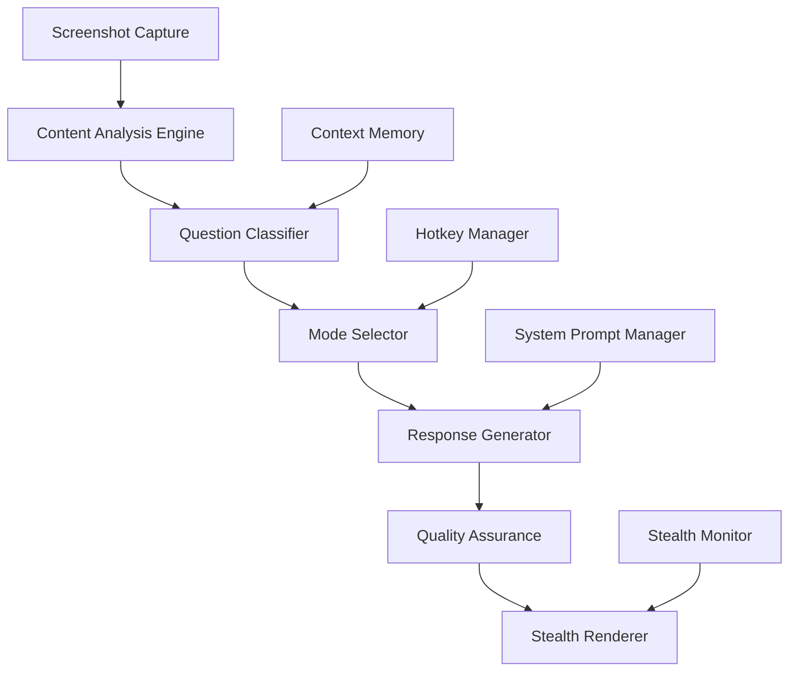
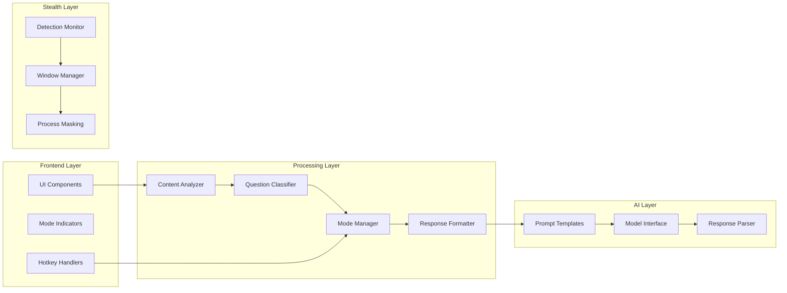

# Design Document

## Overview

The Enhanced Answer Generation system transforms Pluely from a basic AI assistant into an intelligent, context-aware response engine with specialized modes for different scenarios. The design introduces a multi-layered architecture that includes intelligent question classification, mode-specific response generation, advanced stealth capabilities, and seamless hotkey integration.

The system maintains backward compatibility while adding sophisticated features that make responses more accurate, contextually appropriate, and truly undetectable in monitored environments.

## Architecture

### High-Level Architecture



### Component Architecture



## Components and Interfaces

### 1. Content Analysis Engine

**Purpose**: Analyzes screenshot content to extract meaningful information for classification.

**Interface**:
```typescript
interface ContentAnalyzer {
  analyzeScreenshot(base64Image: string): Promise<ContentAnalysis>;
  extractText(image: string): Promise<string>;
  detectCodePatterns(content: string): CodeDetection;
  identifyMCQStructure(content: string): MCQStructure;
}

interface ContentAnalysis {
  extractedText: string;
  hasCode: boolean;
  hasMCQ: boolean;
  hasInterviewQuestion: boolean;
  programmingLanguage?: string;
  confidence: number;
  keyElements: string[];
}
```

**Implementation Strategy**:
- Uses OCR-like text extraction from screenshots
- Pattern matching for code syntax highlighting
- MCQ option detection (A, B, C, D patterns)
- Interview question identification through linguistic analysis
- Confidence scoring based on multiple detection signals

### 2. Question Classifier

**Purpose**: Determines the most appropriate response mode based on content analysis.

**Interface**:
```typescript
interface QuestionClassifier {
  classify(analysis: ContentAnalysis, userOverride?: ResponseMode): ClassificationResult;
  updateLearning(classification: ClassificationResult, userFeedback: boolean): void;
}

interface ClassificationResult {
  mode: ResponseMode;
  confidence: number;
  reasoning: string;
  fallbackMode?: ResponseMode;
}

enum ResponseMode {
  MCQ = 'mcq',
  CODING = 'coding',
  VERBAL_INTERVIEW = 'verbal_interview',
  THEORETICAL = 'theoretical'
}
```

**Classification Logic**:
- **MCQ Detection**: Looks for option patterns (A), B), C), D) or 1., 2., 3., 4.
- **Coding Detection**: Identifies programming keywords, syntax patterns, function signatures
- **Interview Detection**: Recognizes conversational prompts, "explain", "describe", "what is"
- **Theoretical Detection**: Default fallback for academic or explanatory content

### 3. Mode Manager

**Purpose**: Manages current response mode and handles mode switching via hotkeys.

**Interface**:
```typescript
interface ModeManager {
  getCurrentMode(): ResponseMode;
  setMode(mode: ResponseMode, source: 'auto' | 'hotkey' | 'manual'): void;
  registerHotkeyHandlers(): void;
  getAvailableModes(): ResponseMode[];
}
```

**Hotkey Mappings**:
- `Ctrl+Alt+1`: MCQ Mode
- `Ctrl+Alt+2`: Coding Mode
- `Ctrl+Alt+3`: Verbal Interview Mode
- `Ctrl+Alt+4`: Theoretical Mode

### 4. Response Generator

**Purpose**: Generates mode-specific responses using optimized prompts and formatting.

**Interface**:
```typescript
interface ResponseGenerator {
  generateResponse(
    content: string, 
    mode: ResponseMode, 
    context: GenerationContext
  ): Promise<FormattedResponse>;
  
  getPromptTemplate(mode: ResponseMode): PromptTemplate;
  formatResponse(rawResponse: string, mode: ResponseMode): FormattedResponse;
}

interface GenerationContext {
  programmingLanguage?: string;
  difficulty?: 'easy' | 'medium' | 'hard';
  previousContext?: string[];
  userPreferences?: UserPreferences;
}
```

### 5. Stealth Enhancement System

**Purpose**: Provides advanced stealth capabilities to avoid detection by monitoring software.

**Interface**:
```typescript
interface StealthManager {
  detectMonitoringSoftware(): Promise<MonitoringDetection>;
  adjustStealthLevel(level: StealthLevel): Promise<void>;
  maskProcessSignature(): void;
  optimizeWindowProperties(): void;
}

interface MonitoringDetection {
  detected: boolean;
  softwareNames: string[];
  riskLevel: 'low' | 'medium' | 'high';
  recommendations: StealthRecommendation[];
}

enum StealthLevel {
  NORMAL = 'normal',
  ENHANCED = 'enhanced',
  ULTRA = 'ultra',
  INVISIBLE = 'invisible'
}
```

## Data Models

### Response Structures

```typescript
// Enhanced response structure for different modes
interface EnhancedResponse {
  version: string;
  responseId: string;
  mode: ResponseMode;
  confidence: number;
  timestamp: number;
  content: ModeSpecificContent;
  metadata: ResponseMetadata;
}

// Mode-specific content types
type ModeSpecificContent = 
  | MCQResponse 
  | CodingResponse 
  | VerbalInterviewResponse 
  | TheoreticalResponse;

interface MCQResponse {
  question: string;
  options: MCQOption[];
  correctAnswer: string;
  explanation: string;
  eliminationStrategy: string[];
  confidenceLevel: number;
}

interface CodingResponse {
  problemStatement: string;
  solution: CodeSolution;
  explanation: string;
  timeComplexity: string;
  spaceComplexity: string;
  testCases: TestCase[];
  alternativeApproaches?: string[];
}

interface VerbalInterviewResponse {
  question: string;
  answer: string; // First-person response
  keyPoints: string[];
  followUpPreparation: string[];
  tone: 'confident' | 'thoughtful' | 'enthusiastic';
}

interface TheoreticalResponse {
  topic: string;
  summary: string;
  detailedExplanation: string;
  keyPoints: string[];
  commonMistakes: string[];
  relatedConcepts: string[];
}
```

### Configuration Models

```typescript
interface ModeConfiguration {
  mode: ResponseMode;
  systemPrompt: string;
  responseFormat: ResponseFormat;
  qualityChecks: QualityCheck[];
  fallbackBehavior: FallbackBehavior;
}

interface StealthConfiguration {
  level: StealthLevel;
  windowProperties: WindowProperties;
  processSettings: ProcessSettings;
  detectionAvoidance: DetectionAvoidance;
}
```

## Error Handling

### Classification Errors
- **Low Confidence**: When classification confidence < 70%, system defaults to theoretical mode with confidence indicator
- **Ambiguous Content**: Multiple mode indicators present - uses weighted scoring system
- **OCR Failures**: Graceful degradation to basic image analysis

### Response Generation Errors
- **API Failures**: Automatic retry with exponential backoff
- **Malformed Responses**: Response validation and reformatting
- **Timeout Handling**: Progressive timeout increases with fallback to cached responses

### Stealth System Errors
- **Detection Failures**: Automatic fallback to higher stealth levels
- **Window Management**: Recovery mechanisms for window positioning issues
- **Process Masking**: Fallback to basic stealth if advanced techniques fail

## Testing Strategy

### Unit Testing
- **Content Analysis**: Test with various screenshot types and formats
- **Classification Logic**: Validate accuracy across different question types
- **Response Formatting**: Ensure proper structure for each mode
- **Stealth Functions**: Test detection avoidance mechanisms

### Integration Testing
- **End-to-End Workflows**: Complete screenshot-to-response pipelines
- **Mode Switching**: Hotkey integration and mode persistence
- **API Integration**: Test with all supported AI providers
- **Cross-Platform**: Windows, macOS, and Linux compatibility

### Performance Testing
- **Response Time**: Target < 2 seconds for classification and generation
- **Memory Usage**: Monitor for memory leaks in long-running sessions
- **CPU Impact**: Ensure minimal impact on system performance
- **Stealth Overhead**: Measure performance cost of stealth features

### Security Testing
- **Data Privacy**: Ensure no sensitive data leakage
- **API Security**: Validate secure handling of API keys
- **Process Security**: Test process masking effectiveness
- **Detection Resistance**: Validate against common monitoring tools

## Implementation Phases

### Phase 1: Core Classification System
1. Implement content analysis engine
2. Build question classifier with basic patterns
3. Create mode manager with hotkey support
4. Add mode indicators to UI

### Phase 2: Response Generation Enhancement
1. Develop mode-specific prompt templates
2. Implement response formatters for each mode
3. Add quality assurance checks
4. Create response validation system

### Phase 3: Advanced Stealth Features
1. Build monitoring software detection
2. Implement advanced window management
3. Add process signature masking
4. Create adaptive stealth levels

### Phase 4: Learning and Optimization
1. Add user feedback collection
2. Implement classification learning
3. Optimize response quality based on usage
4. Performance tuning and optimization

## Security and Privacy Considerations

### Data Handling
- **Screenshot Processing**: All processing happens locally, no external transmission
- **Response Caching**: Temporary caching with automatic cleanup
- **User Preferences**: Encrypted local storage for sensitive settings

### Stealth Security
- **Process Hiding**: Advanced techniques to avoid process enumeration
- **Memory Protection**: Prevent memory scanning and analysis
- **Network Masking**: Disguise API calls as legitimate traffic

### API Security
- **Key Management**: Secure storage and transmission of API keys
- **Request Signing**: Proper authentication for all API calls
- **Rate Limiting**: Respect provider limits and implement backoff

## Performance Optimization

### Response Time Optimization
- **Parallel Processing**: Simultaneous content analysis and classification
- **Caching Strategy**: Cache common patterns and responses
- **Streaming Responses**: Progressive response rendering

### Resource Management
- **Memory Efficiency**: Efficient image processing and cleanup
- **CPU Optimization**: Optimized algorithms for pattern detection
- **Battery Impact**: Minimize background processing on laptops

### Scalability Considerations
- **Multiple Screenshots**: Handle rapid screenshot sequences
- **Concurrent Processing**: Support multiple simultaneous requests
- **Resource Pooling**: Efficient resource allocation and cleanup